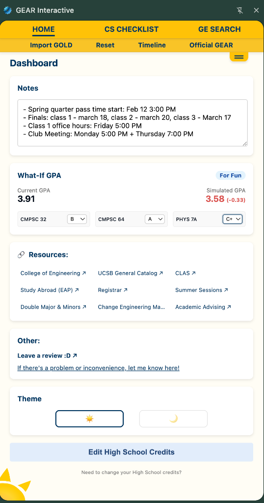
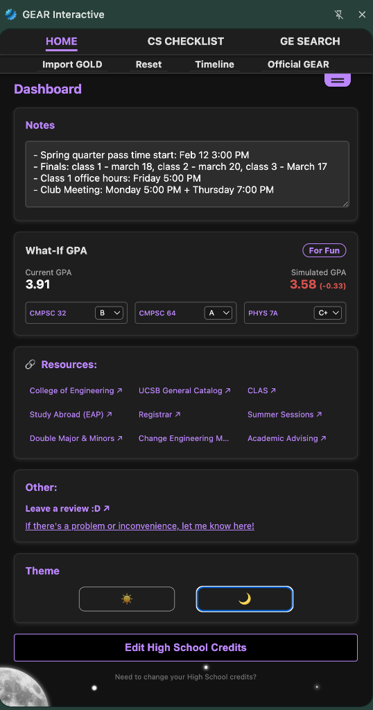
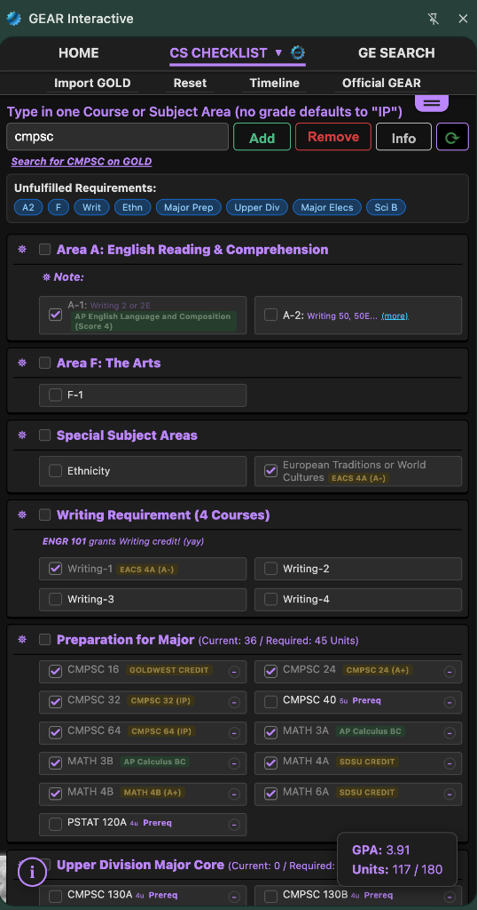
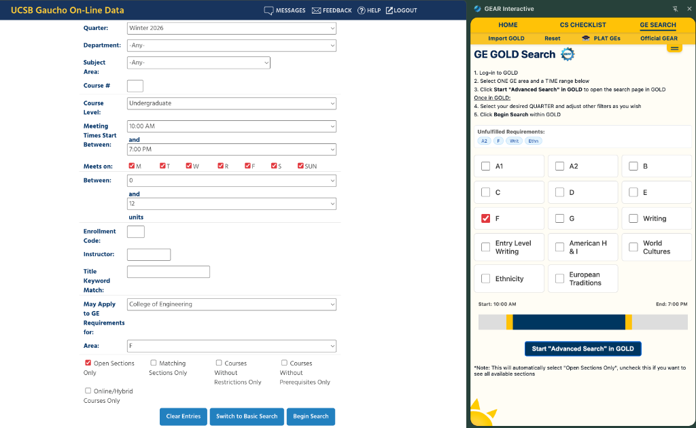
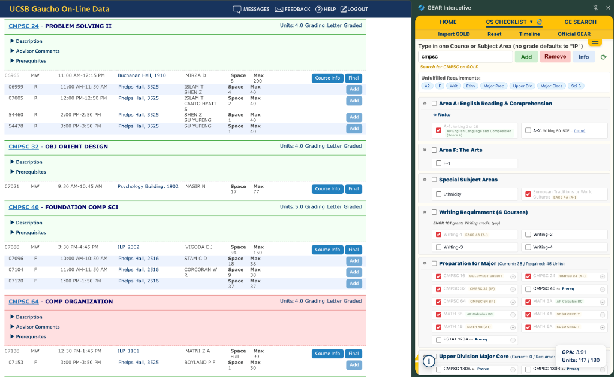

# GEAR Interactive

**GEAR Interactive** is a Chrome Extension that helps UCSB engineering students plan their academic journey. Track your degree progress, visualize requirements, and find courses—all integrated seamlessly with UCSB GOLD.

> **Note**: This extension is not affiliated with UCSB and should not be used for official academic planning. Always consult UCSB resources for the most up-to-date information.

---

[](https://docs.google.com/forms/d/e/1FAIpQLSd_1g-EkIGq2Sca-fnsjkoDQ0gIm9k_dsRwc62bCCLcvaa71A/viewform?usp=header)


---

## 📸 Gallery

<table>
  <tr>
    <td width="50%">
      
      <p align="center"><em>Dashboard with GPA calculator and notes</em></p>
    </td>
    <td width="50%">
      
      <p align="center"><em>Dark mode for late-night planning</em></p>
    </td>
  </tr>
  <tr>
    <td width="50%">
      
      <p align="center"><em>Interactive degree requirement tracker</em></p>
    </td>
    <td width="50%">
      
      <p align="center"><em>Smart course search with GOLD integration</em></p>
    </td>
  </tr>
</table>

---

## ✨ What Can GEAR Interactive Do?

### 📋 Track Your Degree Requirements

GEAR Interactive provides an **interactive checklist** showing exactly what you need to graduate:

- **General Education (GE) Areas**: See which GE requirements you've completed and which you still need
- **Major Preparation**: Track your lower-division major courses
- **Upper Division Courses**: Monitor progress toward your major requirements
- **Progress Visibility**: Real-time unit counts and completion percentages


### 🎓 Import Your Course History

No manual entry needed! Click **"Import GOLD"** to automatically:

- Pull all your completed courses from GOLD
- Match them to your degree requirements
- Calculate your current GPA
- Show your progress at a glance



### 🔍 Find Courses Faster

Need to find a course that satisfies Area F? GEAR Interactive makes it effortless:

1. Click any **unfulfilled requirement** (like "Area F")
2. The extension opens GOLD with **filters already applied**
3. Set your preferred **time range** (e.g., only show 10am-2pm classes)
4. Click **"Start Advanced Search"** to see matching courses

Plus, you'll see **direct links to PLAT** (course difficulty ratings) for every course.


### 📊 GPA Simulator ("What-If")

Planning next quarter? Use the **What-If GPA** calculator to:

- Simulate how different grades will affect your GPA
- Add "In Progress" (IP) courses
- Experiment with course combinations
- **No changes are permanent** — it's just a sandbox!

### 📝 Personal Notes & Resources

- **Scratchpad**: Jot down notes, office hours, or important dates
- **Resource Links**: Quick access to College of Engineering, CLAS, Registrar, and more
- **High School Credits**: Manage AP, IB, and A-Level credit

### 🌙 Light & Dark Mode

Switch between themes for comfortable viewing any time of day.

---

## 🔒 Your Privacy & Security

**We take your privacy seriously.** Here's what you need to know:

### ✅ What GEAR Interactive Does

- Stores **all your data locally** in your browser (using Chrome's secure storage)
- Syncs data across your devices via Google's encrypted infrastructure
- Reads course data **only from GOLD** when you explicitly import

### ❌ What GEAR Interactive Does NOT Do

- ❌ **No external servers** — your data never leaves your browser
- ❌ **No tracking or analytics** — we don't collect usage data
- ❌ **No ads or third-party scripts** — completely clean
- ❌ **No access to** passwords, personal files, or browsing history

### 🔐 Additional Security

- **Open Source**: All code is publicly available for review
- **Signed & Verified**: The extension is digitally signed to prevent tampering
- **Minimal Permissions**: Only requests access to `gold.ucsb.edu` and local storage

For more details, see our [**SECURITY.md**](SECURITY.md).

---

## 📥 Installation

### Chrome Web Store (Recommended)

*Coming soon!* Once published, you'll be able to install directly from the Chrome Web Store.

### Manual Installation (Developer Mode)

1. Download the [latest release](https://github.com/nacsoprog/GEAR-Interactive-extension/releases)
2. Extract the ZIP file
3. Open Chrome and go to `chrome://extensions`
4. Enable **Developer Mode** (toggle in top-right)
5. Click **Load Unpacked** and select the extracted folder

---

## 🎯 Supported Majors

GEAR Interactive provides **detailed tracking** for the following UCSB Engineering majors:

- **Computer Science (CS)**
- **Computer Engineering (CE)**
- **Electrical Engineering (EE)**
- **Mechanical Engineering (ME)**
- **Chemical Engineering (ChemE)**

**Other majors?** You can still use the extension! Select **"Major not listed"** to get a generic course history view and GE tracking.

---

## 🛠️ For Developers

Want to contribute or run GEAR Interactive locally? Check out our [**CONTRIBUTING.md**](CONTRIBUTING.md) for setup instructions.

**Quick Start:**

```bash
git clone https://github.com/nacsoprog/GEAR-Interactive-extension.git
cd GEAR-Interactive-extension
npm install
npm run build
```

Then load the `dist/` folder as an unpacked extension in Chrome.

### Tech Stack

- **React 19** + **TypeScript**
- **Vite** (with CRXJS plugin for Chrome Extension support)
- **Vanilla CSS** (modular, light & dark themes)

---

## 🤝 Contributing

We welcome contributions! Whether you want to:

- Add support for more majors
- Fix bugs or improve features
- Enhance documentation
- Report issues

Please read our [**CONTRIBUTING.md**](CONTRIBUTING.md) to get started.

---

## 📞 Get Help & Share Feedback

- **Feedback Form**: [Google Form](https://docs.google.com/forms/d/e/1FAIpQLSd_1g-EkIGq2Sca-fnsjkoDQ0gIm9k_dsRwc62bCCLcvaa71A/viewform?usp=header)
- **Report Issues**: [GitHub Issues](https://github.com/nacsoprog/GEAR-Interactive-extension/issues)
- **Email**: [gear.interactive.help@gmail.com](mailto:gear.interactive.help@gmail.com)

---

## 📄 License

This project is licensed under the **MIT License**. See [LICENSE](LICENSE) for details.

---

**Made with 💙 for UCSB students by UCSB students**
